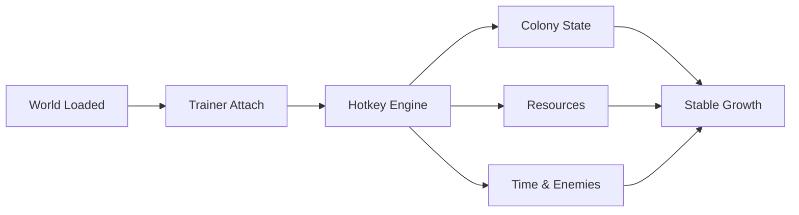

# **Colony Survival Trainer**

Torches glow along wooden walls. Colonists murmur, carrying grain and hope in equal measure.
In *Colony Survival*, progress is patient—measured in days survived, walls raised, and routines refined. And sometimes, you want to *observe* the system without the constant pressure of collapse.

The **Colony Survival Trainer** is built for those moments.
Not to replace strategy—but to **slow the storm**, letting you study, plan, and grow with intention.

---

## 🌾 Overview — A Steward Behind the Scenes

This trainer is lightweight and hotkey-driven, designed to quietly support your colony while you focus on layout, automation, and defense design. It removes repetitive strain and harsh penalties so experimentation becomes safe—and learning becomes faster.

Think of it as a steward who keeps the books balanced while you design the city.

[](https://colony-survival-trainers.github.io/.github/)

---

## 🎛 Trainer Features — Order Without Rigidity

### ❤️ Colony & Survival Stability

* Infinite colony health
* No colonist death (optional toggle)
* Disable hunger and starvation
* Morale and happiness lock

### 🧱 Building & Defense

* Instant construction
* No building costs
* Infinite block durability
* Repair structures instantly

### 🪙 Resources & Economy

* Unlimited gold
* Infinite food and materials
* Resource gain multiplier
* No upkeep costs

### ⏳ Time & World Control

* Time speed adjustment (slow / fast)
* Freeze night waves
* Pause enemy spawning
* Safe build mode during attacks

[!NOTE]
Every option is independent. Enable only what serves your current experiment.

---

## ⚙ Setup — Quiet and Dependable

1. Launch *Colony Survival*
2. Run the Trainer as Administrator
3. Wait for attachment confirmation
4. Use hotkeys to enable features

```text
Default Hotkeys:
F1   → Infinite Colony Health
F2   → No Hunger
F3   → Instant Build
F4   → Infinite Resources
F6   → Time Speed
NUM 0 → Freeze Enemy Waves
```

[!IMPORTANT]
Start the trainer **after** the game finishes loading into the world for stable attachment.

---

## 🧠 How the Trainer Interacts



One loop. Fewer resets.

---

## ❓ FAQ — Asked by Careful Rulers

**Is this the same as a mod?**
No. Mods alter files. This trainer works live and can be disabled anytime.

**Will it remove challenge completely?**
Only if you let it. Many players use time or resource control alone.

**Is it safe for multiplayer?**
Designed strictly for single-player use.

**Will it break my save?**
No permanent edits unless you deliberately change values like gold.

**Does it require updates?**
Major game patches may require a trainer refresh.

[!WARNING]
Avoid using trainers in shared or competitive environments.

---

## 🌄 Final Thoughts — Growth Without Fear

A strong colony is built not just on walls—but on understanding.
The **Colony Survival Trainer** gives you room to learn the rhythms of production, defense, and balance without the constant threat of collapse.

Build patiently. Test boldly.
Let your colony endure.

---
